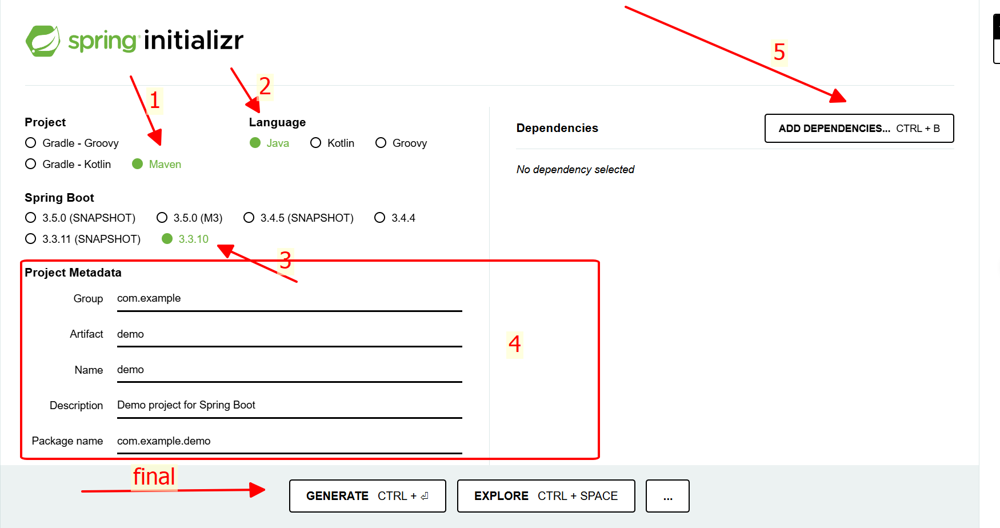
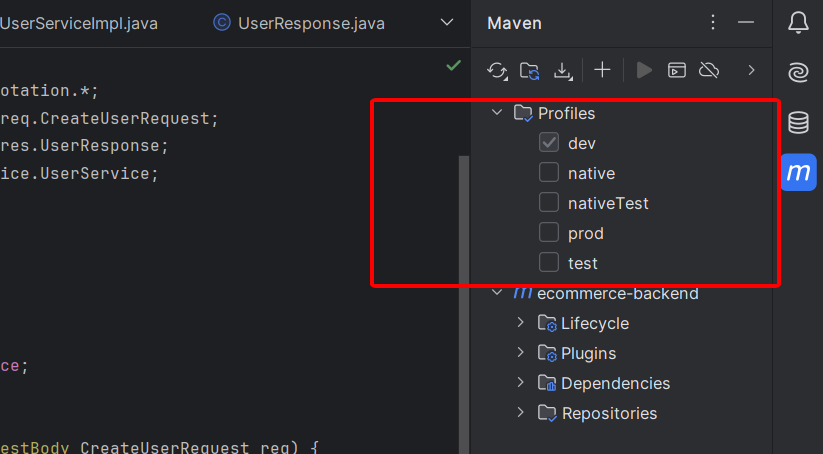

# **Bài 1: Setup code base...**

**Spring Boot là một framework mạnh mẽ giúp đơn giản hóa việc phát triển ứng dụng Java. Trong bài blog này, chúng ta sẽ cùng nhau tìm hiểu các công cụ cần thiết, các annotation quan trọng và cách tạo một dự án Spring Boot cơ bản...**

---

## Các Công Cụ Cần Thiết

Dưới đây là danh sách các công cụ bạn cần để bắt đầu với Spring Boot:

| **Công cụ**       | **Mô tả**                                                  |
| ----------------- | ---------------------------------------------------------- |
| **IntelliJ IDEA** | IDE mạnh mẽ hỗ trợ phát triển Java và Spring Boot          |
| **Docker**        | Công cụ container hóa giúp đóng gói và triển khai ứng dụng |
| **JDK 17**        | Phiên bản Java Development Kit cần thiết cho Spring Boot   |
| **Postman**       | Ứng dụng hỗ trợ kiểm tra và phát triển API                 |

---

## Các Annotation Quan Trọng Trong Spring Boot

Annotation là một phần không thể thiếu trong Spring Boot, giúp định nghĩa và quản lý các thành phần của ứng dụng. Dưới đây là bảng tổng hợp các annotation phổ biến:

### 1. Cấu trúc của project Spring Boot

```
├── Dockerfile                # File cấu hình Docker để đóng gói ứng dụng
├── README.md                 # File mô tả dự án
├── docker-compose.yml        # File cấu hình Docker Compose
├── initdb.sql                # Script SQL khởi tạo database
├── pom.xml                   # File cấu hình Maven
└── src                       # Thư mục chứa mã nguồn
├── main                      # Mã nguồn chính
│   ├── java                  # Mã Java
│   │   └── vn                # Package gốc
│   │       └── edu
│   │          └── hcmuaf
│   │              └── fit
│   │                  └── ecommerce
│   │                       ├── EcommerceBackendServiceApplication.java  # Class khởi động ứng dụng
│   │                       ├── common          # Package chứa các tiện ích chung
│   │                       ├── config          # Package chứa cấu hình
│   │                       ├── controller      # Package chứa các controller
│   │                       ├── exception       # Package chứa các exception tùy chỉnh
│   │                       ├── entity          # Package chứa các entity/model
│   │                       ├── repository      # Package chứa các repository (DAO)
│   │                       └── service         # Package chứa logic nghiệp vụ
│   └── resources                               # Thư mục tài nguyên
│       ├── application-dev.yml                 # Cấu hình môi trường dev
│       ├── application-prod.yml                # Cấu hình môi trường prod
│       ├── application-test.yml                # Cấu hình môi trường test
│       ├── application.properties              # Cấu hình mặc định
│       ├── application.yml                     # Cấu hình YAML chính
│       ├── banner.txt                          # File banner tùy chỉnh
│       ├── static                              # Thư mục chứa tài nguyên tĩnh
│       └── templates                           # Thư mục chứa template (nếu dùng MVC)
└── test                                        # Mã nguồn kiểm thử
       └── java
            └── vn
                └── edu
                    └── hcmuaf
                        └── fit
                            └── EcommerceBackendServiceApplicationTests.java
```

## Hướng Dẫn Tạo Dự Án Spring Boot Cơ Bản

Dưới đây là các bước chi tiết để tạo một dự án Spring Boot từ đầu:

#### Bước 1: Tạo Dự Án

- Truy cập [Spring Initializr](https://start.spring.io).
- Chọn các thông tin cơ bản:
  

#### Bước 2: Tạo Banner

- Sử dụng [Spring Boot Banner Generator](https://www.bootschool.net/ascii) để tạo file `banner.txt`...
- Đặt file này vào thư mục `src/main/resources` để tùy chỉnh giao diện console khi khởi động...

#### Bước 3: Thiết Lập Maven Profile

```xml
<profiles>
		<profile>
			<id>dev</id>
			<activation>
				<activeByDefault>true</activeByDefault>
			</activation>
			<properties>
				<spring.profiles.active>dev</spring.profiles.active>
			</properties>
		</profile>
		<profile>
			<id>test</id>
			<properties>
				<spring.profiles.active>test</spring.profiles.active>
			</properties>
		</profile>
		<profile>
			<id>prod</id>
			<properties>
				<spring.profiles.active>prod</spring.profiles.active>
			</properties>
		</profile>
	</profiles>
```

- Cấu hình các file `.properties` hoặc `.yml`

  `application.yml`

```yml
server:
  port: 8080
spring:
  application:
    name: ecommerce-backend
  profiles:
    active: @spring.profiles.active@
```

`application-dev.yml`

```yml
spring:
  config:
    activate:
      on-profile: dev

  devtools:
    add-properties: true
```

`application-test.yml`

```yml
spring:
  config:
    activate:
      on-profile: test

  devtools:
    add-properties: true
```

`application-prod.yml`

```yml
spring:
  config:
    activate:
      on-profile: prod

  devtools:
    add-properties: true
```

- Giờ hãy reload lại `maven` nếu thứ này đã xuất hiện bên góc phải của `Intelij` thì chúc mừng, bạn đã cấu hình thành công....



#### Bước 4: Tạo Dockerfile

- Giờ thì bắt đầu đóng gói ứng dụng với `docker` thôi mấy anh chị ơi...

- Tạo `Dockerfile` vào thư mục gốc...

```dockerfile
FROM openjdk:17

ARG JAR_FILE=target/*.jar

COPY ${JAR_FILE} ecommerce-backend.jar

ENTRYPOINT ["java", "-jar", "ecommerce-backend.jar"]

EXPOSE 8080
```

- Sau khi đã có `Dockerfile` giờ thì hãy viết kịch bản để cho `docker` làm việc...

- Tạo 1 file tên là `docker-compose.yml` vào thư mục gốc luôn...

```yml
services:
  postgres:
    image: postgres:16
    container_name: ecommerce_postgres
    cap_add:
      - SYS_NICE
    restart: always
    environment:
      POSTGRES_USER: admin
      POSTGRES_PASSWORD: admin
      POSTGRES_DB: ecommercedb
    ports:
      - "5432:5432"
    volumes:
      - postgres_data:/var/lib/postgresql/data
      - ./initdb.sql:/docker-entrypoint-initdb.d/initdb.sql
    networks:
      - default

  ecommerce-backend:
    container_name: ecommerce-backend
    build:
      context: ./
      dockerfile: Dockerfile
    ports:
      - "8080:8080"
    networks:
      - default

networks:
  default:
    name: ecommerce-network

volumes:
  postgres_data:
```

- Giải thích sơ qua 1 xíu tại sao lại có tận 2 file docker là `Dockerfile` và `docker-compose.yml`

- **Dockerfile:**

  - Là một file chứa các lệnh (_instructions_) để xây dựng một **Docker image**.

  - Nó giống như một "công thức" hướng dẫn Docker cách tạo ra một image tùy chỉnh từ một image cơ sở (base image).

- **docker-compose.yml:**

  - **Docker Compose** là một công cụ (và file cấu hình docker-compose.yml) dùng để định nghĩa và quản lý **nhiều container** cùng lúc.

  - Chạy nhiều container (ví dụ: ứng dụng + database) cùng lúc.

  - Nó dựa trên một file `YAML`để mô tả các dịch vụ (services), mạng (networks) và volume

- **Tóm tại thì `Dockerfile` nó kiểu như là 1 kịch bản nhỏ trong 1 cái kịch bản lớn là `docker-compose.yml`, hỉu dị được ròi...**

##### Viết đã đời thì giờ tới cách sài:

- `mvn clean install -P dev`: câu lệnh này sẽ bảo maven dịch project này thành file `.jar` cho mình...

- `docker build -t ecommerce-backend:latest`

  - Lệnh docker để tạo image, `-t ecommerce-backend:latest` ở đây chính là tên của image

- `docker run -it -p 8080:8080 --name backend-service ecommerce-backend:latest`

  - Câu lệnh này chạy một **container** từ image vừa tạo và ánh xạ cổng để truy cập ứng dụng.

  - `backend-service` là tên của container, `ecommerce-backend:latest` là tên của image mà mình vừa tạo ở trên kia

Sao bài học này thì ae đã có thể tự tạo cho mình 1 project base hoàn chỉnh đúng cấu trúc thực tế, mình sẽ gặp lại nhau ở những bài kế tiếp...
